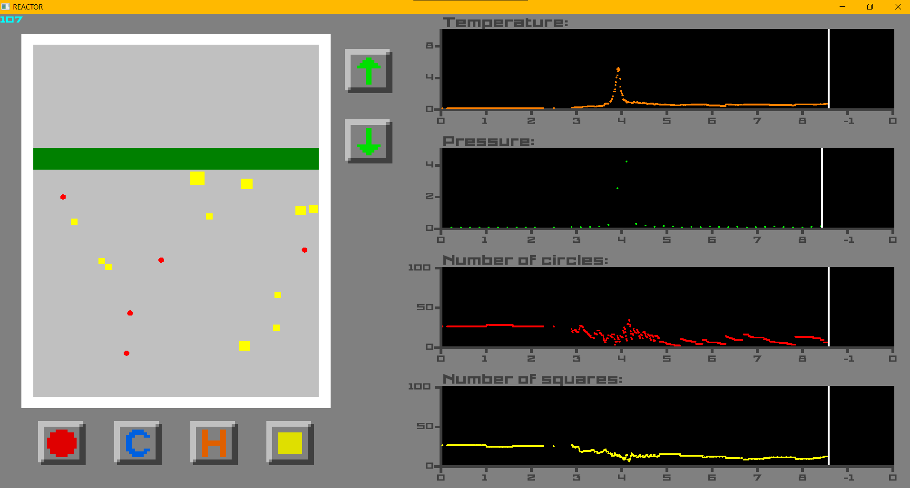
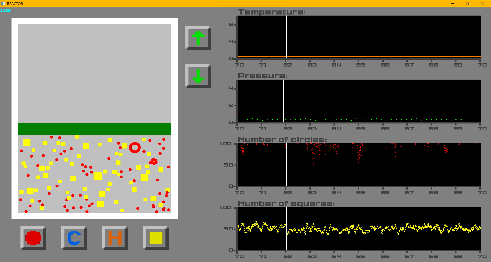
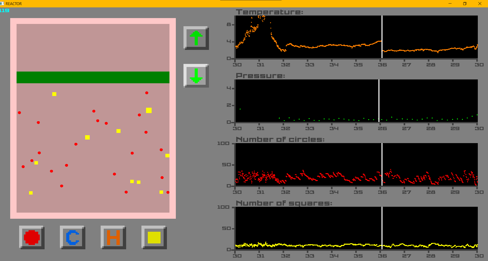
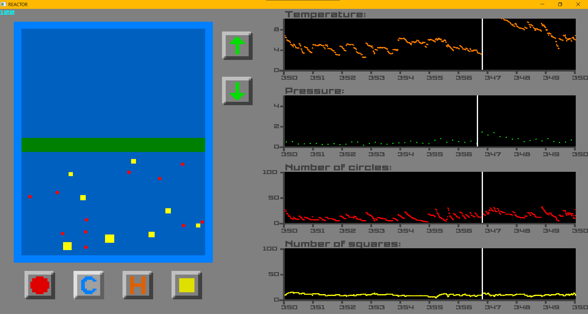

# Thermodynamics-simulation
Simple application for simulation of thermodynamic processes in ideal gas
---
###### Written in C++ using the SFML library

## Screenshots of the application in action

### For a detailed description, see the [practice project report file](Report%20on%20practical%20task.docx)
